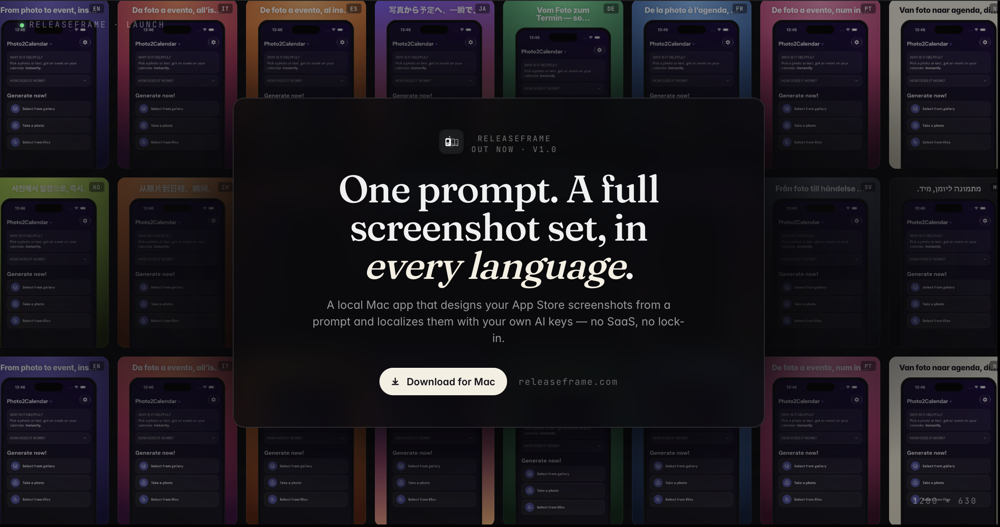

# ReleaseFrame

**App Store screenshots, designed by AI.**

Stop wrestling with Figma the night before you ship. ReleaseFrame
generates polished App Store screenshot carousels from a description of
your app, then lets you tweak them in plain English.

[**releaseframe.com**](https://releaseframe.com) ·
[**Download for Mac**](https://github.com/simonegiammy/ReleaseFrame/releases/latest) ·
[Open the web app](https://releaseframe.com)

---

## Two ways to use it

**Native macOS app** — one-time lifetime license. Bring your own Claude
or Codex agent for unlimited generations. Push finished screenshots
straight to App Store Connect from the app — no zip / drag-and-drop
dance. Requires macOS 14 or newer.

**Web app** — runs in any browser. Subscription tiers (Free, Pro,
Ultimate). Same generation flow, same export quality.

Both share the same design engine, so anything you produce in one looks
the same in the other.

## What it does

- Takes a short description of your app and proposes a full screenshot
  story (hook, features, social proof, CTA)
- Generates the right pixel sizes for every device class (iPhone 6.7",
  6.5", iPad 12.9", and more)
- Lets you edit each slide with natural-language prompts ("make the
  headline shorter and the screenshot bigger")
- Exports clean, App Store-ready images — or pushes them directly to
  App Store Connect
- Localizes the same story across multiple languages in one click

## About this repository

This repo is the **public release home** for the macOS app. It hosts:

- Signed and Apple-notarized DMGs ([Releases](https://github.com/simonegiammy/ReleaseFrame/releases))
- The Sparkle appcast that powers in-app updates

The product source code is in private repositories. Two-line summary
for the curious:

- **macOS app** — SwiftUI, distributed outside the App Store with
  Developer ID + notarization, auto-updates via Sparkle
- **Web app** — Vite + TanStack Start on Vercel, backend on Firebase
  (Firestore, Cloud Functions, Firebase AI / Gemini)

## Built by

[Simone Giammusso](https://github.com/simonegiammy) — an indie dev who
got tired of remaking screenshots by hand.

Questions, feedback, or "this is broken on my machine" reports go to
**simone@releaseframe.com**. Replies guaranteed (it's just me).
